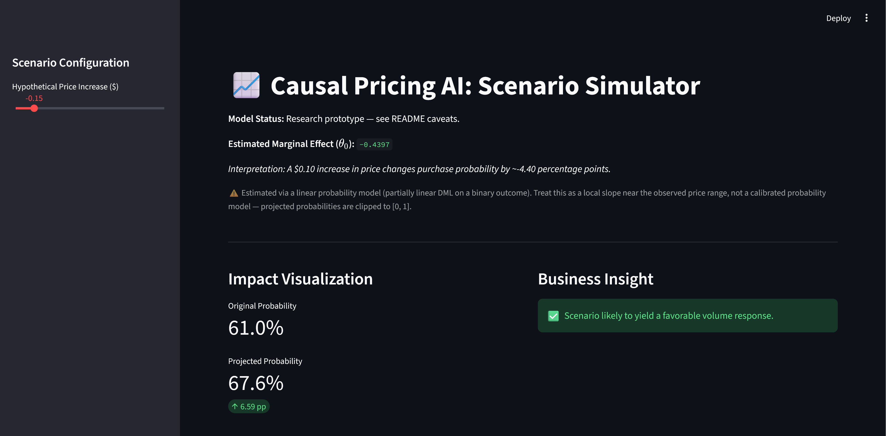

# Causal Pricing Engine

Estimates the causal effect of price on purchase probability from observational retail data, and serves it as a scenario simulator.




## The problem

Sales data can't tell a pricing team what a price change costs them. Customers who buy at higher prices are disproportionately loyal buyers, and competitors discount in response to your own moves — so a naive price-vs-purchase regression measures brand loyalty and competitive dynamics as much as it measures demand. The estimate it produces is biased in an unknown direction by an unknown amount, which is worse than useless for a pricing decision.

This pipeline separates the demand response from the confounding, using Double Machine Learning to estimate the marginal effect of price on purchase probability while flexibly controlling for loyalty and competitor pricing. It then puts that estimate behind a slider so a stakeholder can test a scenario before committing to it.

Data: the ISLR `OJ` dataset — 1,070 orange juice purchases, treatment is Citrus Hill's sale price, outcome is whether the customer chose Citrus Hill over Minute Maid.

## Run it

```bash
uv sync && make run-all
```

Fits the model, writes `data/processed/model_metrics.json`, then launches the Streamlit simulator on `:8501`.

Requires [`uv`](https://docs.astral.sh/uv/) and the dataset at `data/raw/oj_data.csv`. To produce it from R:

```r
write.csv(ISLR2::OJ, "data/raw/oj_data.csv", row.names = FALSE)
```

Paths, fold count, and seed are overridable via `.env` (see `config.py` for defaults).

## The result

**θ̂₀ = −0.5570, p < 0.001.** A $1.00 increase in Citrus Hill's sale price lowers the probability of choosing Citrus Hill by roughly 55.7 percentage points, holding brand loyalty and competitor price/promotion fixed.

Three caveats I'd rather state than have someone find:
- Observed sale prices span roughly $1.69–$2.09, so a full $1.00 move is outside the support of the data. The per-dollar figure is a linear extrapolation and should be read as a local slope, not a prediction about dollar-scale price changes.
- The outcome is binary but the estimator is a partially linear model, so this is effectively a linear probability model. Fitted probabilities are clipped to [0, 1] in the UI.
- Observations cluster by store and week; the model was fitted with i.i.d. standard errors, so the reported p-value is understated. The point estimate is the defensible quantity here.

**Robustness.** Omitted-variable-bias sensitivity analysis puts the robustness value at ≈14.9%: an unobserved confounder would need to explain about 14.9% of residual variance in both treatment and outcome to drive the estimate to zero. That's substantially more than any single observed covariate explains here, so the sign and rough magnitude survive plausible unobserved confounding.

`PriceCH` and `SpecialCH` are deliberately excluded from the confounder set — `SalePriceCH` is a deterministic function of both, so conditioning on them destroys the exogenous treatment variation the orthogonal score depends on. This is the one modeling decision most likely to be questioned, so it's documented at the point of decision in `services/data_ingestion.py` and asserted in the tests.

## What I'd do differently

- **Use a natively bounded estimator.** The LPM approximation is the weakest link. `DoubleMLIRM` or a logistic PLR gives bounded outputs and removes the UI clipping hack entirely.
- **Tune the nuisance learners.** LightGBM hyperparameters are static. With ~1,000 rows and 5-fold cross-fitting, nested cross-validation for the nuisance models is cheap and would reduce overfitting risk in the folds.
- **Widen the confounder set.** Four covariates is thin. Store and week fixed effects are available in the source data and would absorb a meaningful chunk of what's currently residual confounding.
- **Benchmark the sensitivity bounds instead of hardcoding them.** The 5% cf_y/cf_d values are illustrative. The informative version benchmarks the hypothetical confounder against the explanatory power of `LoyalCH`, which answers "how does this compare to the strongest thing we *did* observe."
- **Ship the data.** Requiring an R export to run the project is friction I created for no reason.

## Stack

Python 3.12 · DoubleML · LightGBM · pandas · scikit-learn · Streamlit · uv · Ruff · MyPy (strict) · Pytest

## Layout

```
src/causal_inference/
├── services/    data ingestion, causal-role partitioning (Y/D/X), artifact I/O
├── core/        DML/PLR estimation + OVB sensitivity analysis
├── api/         Streamlit scenario simulator
├── config.py    environment-driven configuration
└── main.py      pipeline orchestrator
```

Ingestion → DML estimation → JSON artifact → UI. The dashboard reads the artifact rather than refitting, so it starts instantly and always displays a reproducible number tied to a specific pipeline run.

`make all` runs format, lint, typecheck, and tests. `src/` is MyPy-strict with a `py.typed` marker; the dependency graph is fully locked via `uv.lock`.
